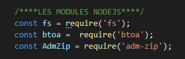
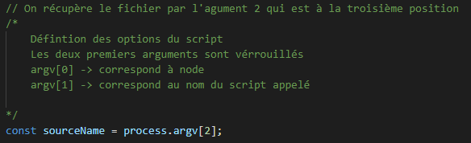
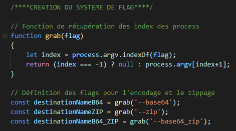
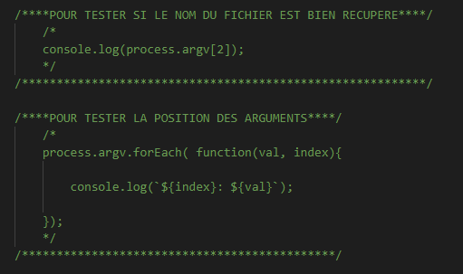
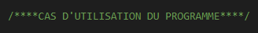
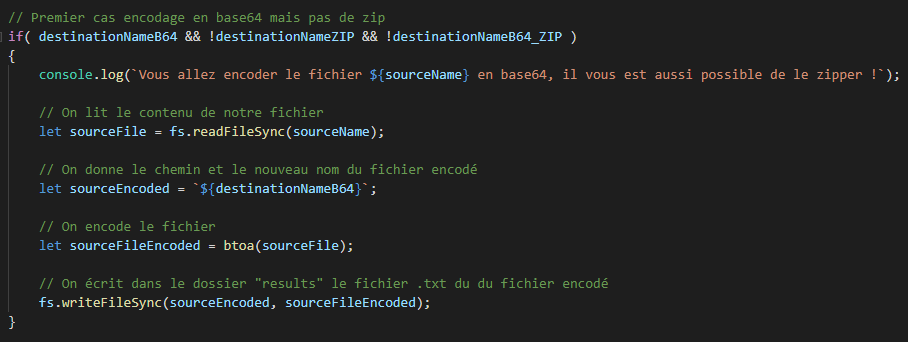
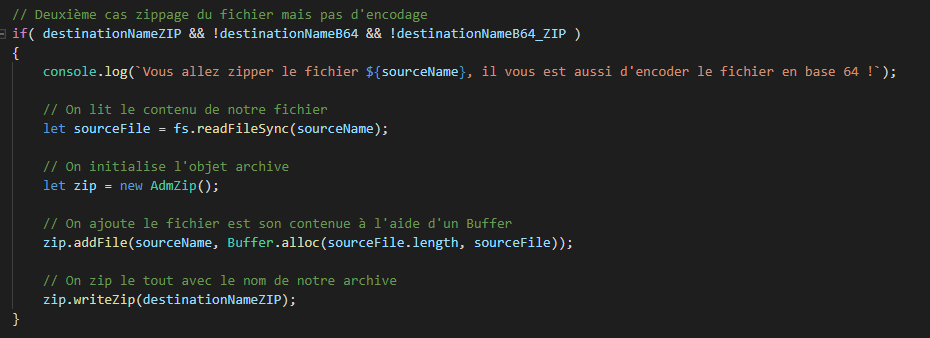
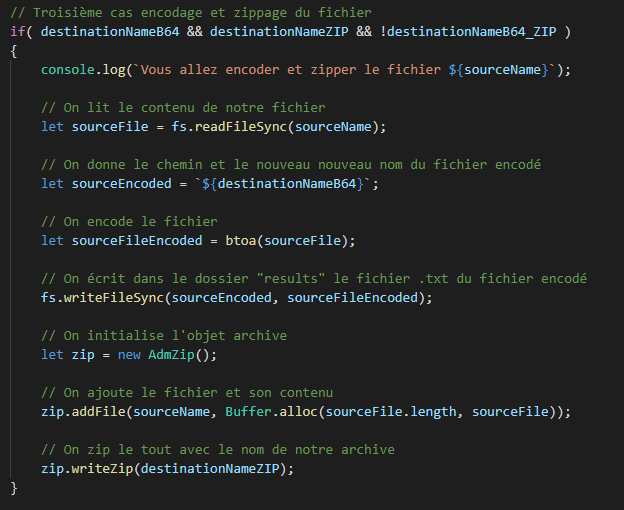
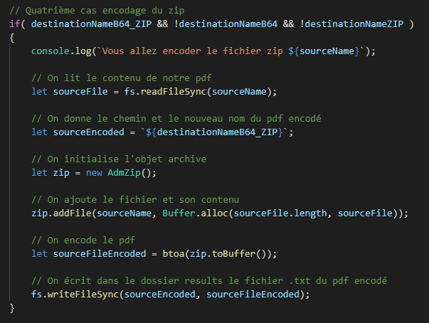
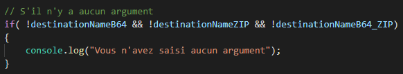

# Développement en ligne de commande : Encode base64 & Zip

Vous pouvez accéder au code source [ici](https://github.com/RexT2507/Encode_B64_ZIP).

#

## Ajout des modules

#

On ajoute les modules dans le programme :

On va lister ces modules :

* `fs`      - Le module du système de fichiers Node.js vous permet de travailler avec le système de fichiers de votre ordinateur.
* `btoa`    - Le module vous permet d'encoder le contenu de votre Buffer en Base64.
* `adm-zip` - Le module vous permet de zipper en un dossier le contenu de votre Buffer.

#

## Définition des options du script

#

On va définir les options du script : 

La construction des options d'un script nodejs a toujours le même schéma :

* `argv[0]`    - Corresponds à l'exécutable de NodeJs.
* `argv[1]`    - Corresponds au nom du script appelé.
* `argv[2]`    - Corresponds au nom du fichier source que l'on veut traiter.
* Les autres argv sont les options du programme.

#

## Ajout du système de flag

#

On va ajouter notre système de flag, afin de sélectionner les options de traitement que l'on veut effectuer :

Dans un premier temps on va créer une fonction qui permet de récupérer les flags des différents process et si jamais l'index est déjà lu on parcourt l'index suivant.

On définit les flags pour l'encode, le zippage et les autres :

* `--base64`        - Permets d'encoder le fichier en base64.
* `--zip`           - Permets de zipper le fichier en zip.
* `--base64_zip`    - Permets d'encoder un point zip.

#

## Ajout des tests sur la position des arguments

#

Il est important de pouvoir effectuer des tests, par exemple de savoir si on récupère bien le fichier ou encore pour vérifier la position des différents arguments du programme.

Pour l'instant il faut décommenter ces tests afin de pouvoir y accéder mais pourquoi ne pas faire un flag pour appeler le test ou les tests qu'il nous faut.

#

## Ajout de la structure des cas d'utilisation du programme

#

Pas de code seulement un grand commentaire, bien structurer son code est toujours important ;) !

## Premier cas encodage en base64 mais pas de zip

#

Nous allons voir le premier cas d'utilisation du programme on reçoit un fichier, puis on encode ce fichier en un fichier en .txt qui contient le contenu de notre fichier en base64.

#

Pour cela nous allons utiliser le flag --base64, nous allons donc utiliser une condition pour dire que la balise de base64 est à true.

#

Bien évidemment le zip ne fonctionnera pas dans le premier cas. Regardons le code.

## Deuxième cas zippage du fichier mais pas d'encodage

#

Nous allons voir le deuxième cas d'utilisation du programme on reçoit un fichier, puis on zip de fichier en un .zip qui contient notre fichier compressé.

#

Pour cela nous allons utiliser le flag --zip, nous allons donc utiliser une condition pour dire que la balise de zip est à true.

#

Bien évidemment l'encodage ne fonctionnera pas dans le deuxième cas. Regardons le code.

## Troisième cas encodage et zippage du fichier

#

Nous allons voir le troisième cas d'utilisation du programme on reçoit un fichier, puis on encode le fichier et ont le zip, on effectue les deux tâches précédentes.

#

Pour cela on utilise les deux flags précédents --base64 et --zip, il y a une condition qui va vérifier que les deux balises soient à true pour effectuer les actions.

## Quatrième cas encodage du zip

#

Nous allons voir le quatrième cas d'utilisation du programme on reçoit un fichier, puis on zip ce fichier et on encode le fichier zip.

#

Cette fonction du programme a été créer à la suite d'une demande d'un utilisateur qui ne voulait pas lancer le programme deux fois pour zipper puis pour encoder ! La fonctionnalité a donc été rajoutée ;)

#

Pour cela nous allons utiliser le flag --base64_zip

## Retour en cas d'argument absent

#

Il faut penser à mettre une erreur si on ne saisit aucun argument, cela va de soi !

On en a fini avec la partie développement !

