# Utilisation du programme en ligne de commande : Encode base64 & Zip

#

Nous allons voir comment utiliser le programme en ligne de commande, avant toute chose assurez-vous d'avoir bien lu le readme qui contient toute la procédure d'installation des logiciels nécessaires au fonctionnement du logiciel.

## Lancer le programme

Dans un premier temps allez dans le dossier ou vous avez téléchargé le programme et ouvrez une invite de commande.

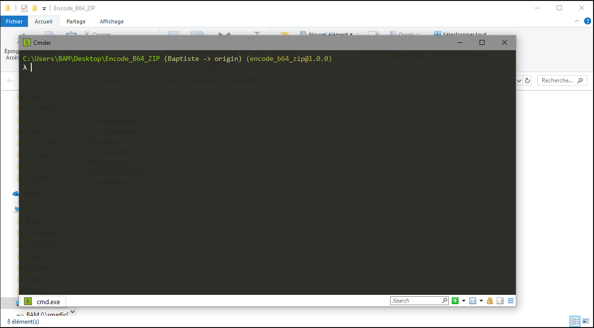

On va maintenant placer les arguments dans le bon ordre, pour commencer NodeJs, puis le nom du programme, le fichier que l'on veut traiter et enfin les options de traitement que l'on veut lui appliquer.

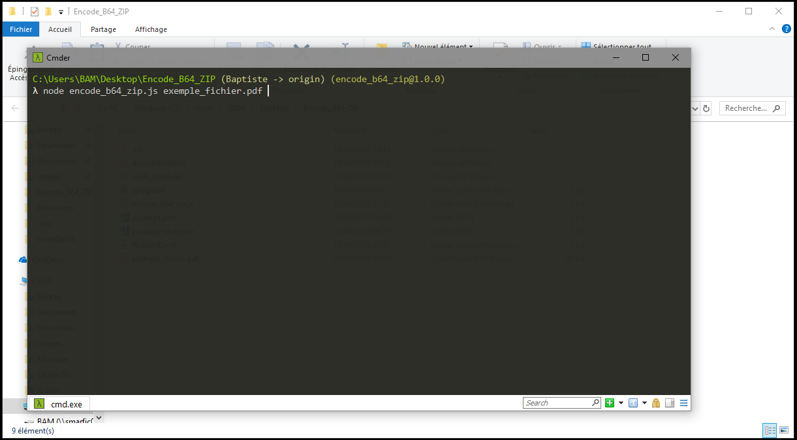

Voilà nous avons placé nos arguments, nous allons voir par la suite les différentes options que l'on peut utiliser dans ce programme. Il est important de noter que l'on peut lire un fichier de n'importe où et l'écrire n'importe où, il suffit de préciser le chemin.

Par exemple :

    node encode_b64_zip.js C:\Users\BAM\Documents\exemple_fichier.pdf

#

## Premier cas encodage en base64 mais pas de zip

#

Pour encoder un fichier en base64, il suffit de donner le fichier en entrée suivi de l'option --base64 suivit du nom de fichier.

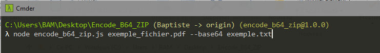

Comme je l'ai dit précédemment il est possible de donner le dossier de destination en plus du nom de fichier en sortie.

Par exemple :

    node encode_b64_zip.js exemple_fichier.pdf --base64 C:\Users\BAM\Documents\resultats\exemple.txt

On appuie sur entrée pour commencer le traitement

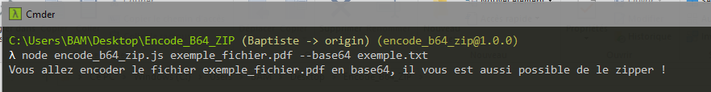

Voilà le traitement c'est bien effectué, on peut lire le message nous le confirmant. 

Voyons le résultat : 

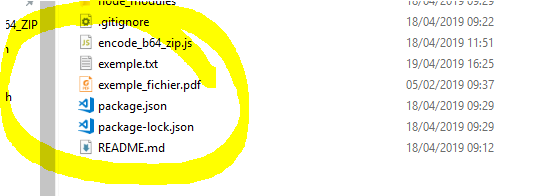

Nous avons bien nos deux fichiers, le fichier source qui est intact et le fichier.txt qui contient le fichier précédent encodé en base64.

Regardons le contenu pour être sûr :

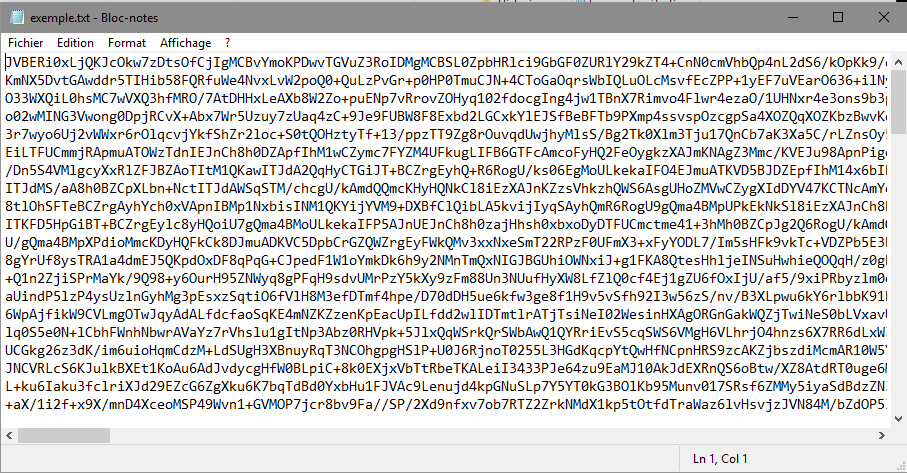

Ok le fichier est bien encodé :)

#

## Deuxième cas zippage du fichier mais pas d'encodage

#

Pour zipper un fichier il suffit de donner le fichier en entrée suivi de l'option --zip suivit du nom de fichier.

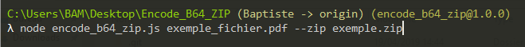

On appuie sur entrée pour commencer le traitement

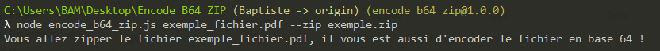

Voilà le traitement c'est bien effectué, on peut lire le message nous le confirmant. 

Voyons le résultat : 

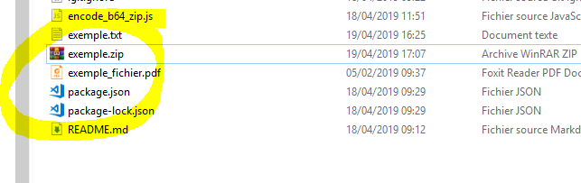

On retrouve bien notre fichier source dans le zip !

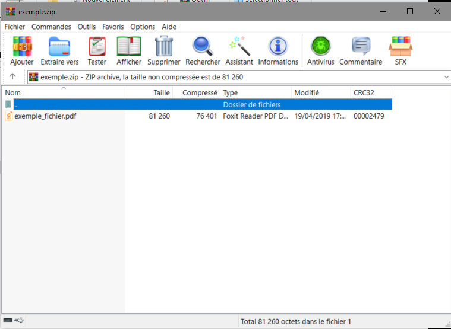

## Troisième cas encodage et zippage du fichier

#

Pour encoder un fichier et le zipper, effectuer les deux actions précédentes en sommes ;)

#

Il suffit d'utiliser les deux commandes précédentes en une seule !

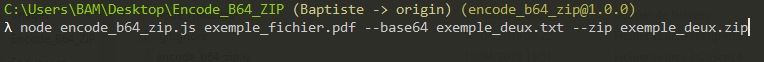

On appuie sur entrée pour commencer le traitement

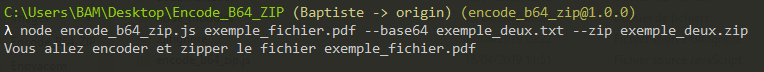

Voilà le traitement c'est bien effectué, on peut lire le message nous le confirmant. 

Voyons le résultat :

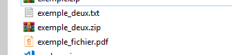

## Quatrième cas encodage du zip

#

Cette fonction du programme a été créer à la suite d'une demande d'un utilisateur qui ne voulait pas lancer le programme deux fois pour zipper puis pour encoder ! La fonctionnalité a donc été rajoutée ;)

#

Pour ce faire on va taper la commande --base64_zip suivi du nom de fichier que l'on veut en sortie

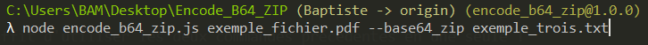

Voilà le traitement c'est bien effectué, on peut lire le message nous le confirmant.

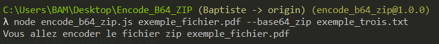

Voyons le résultat :

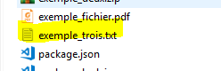

Regardons le contenu de notre fichier texte pour être parfaitement sûr :

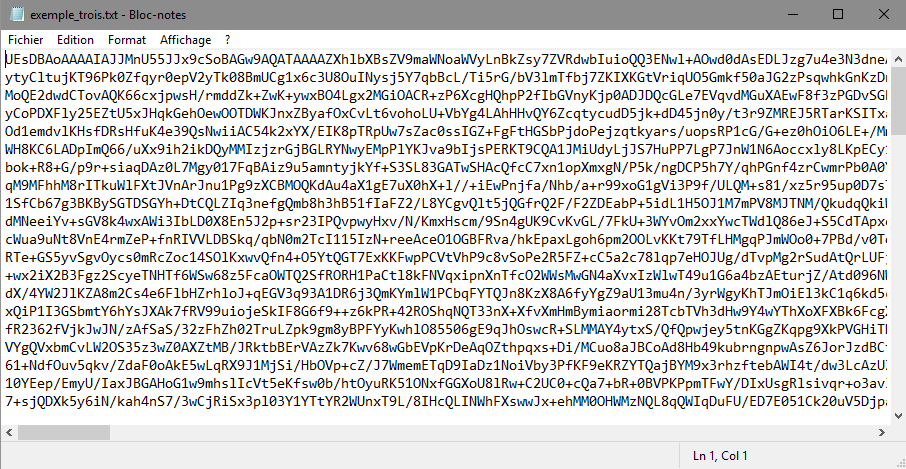

## Retour en cas d'argument absent

#

Si on ne saisit pas d'argument dans notre ligne de commande nous verrons le message d'erreur suivant :

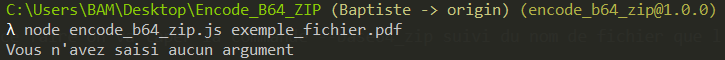

Rien ne se passe......

#

Voilà vous savez utiliser le programme en ligne de commande.

